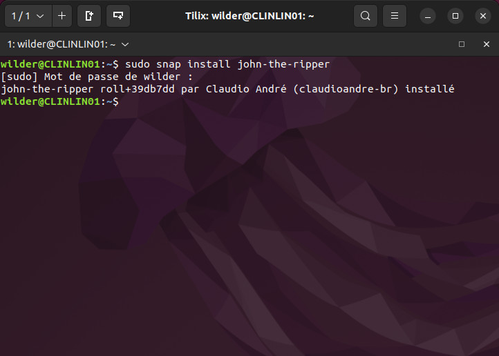
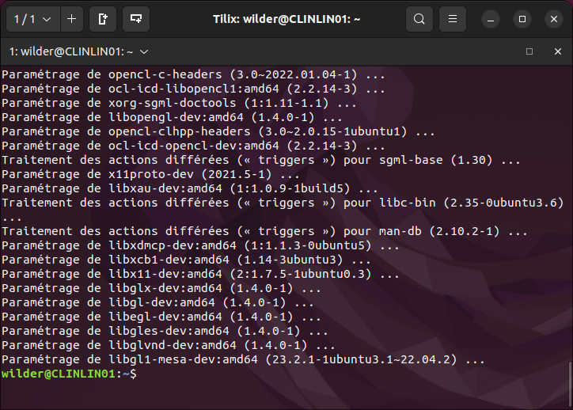
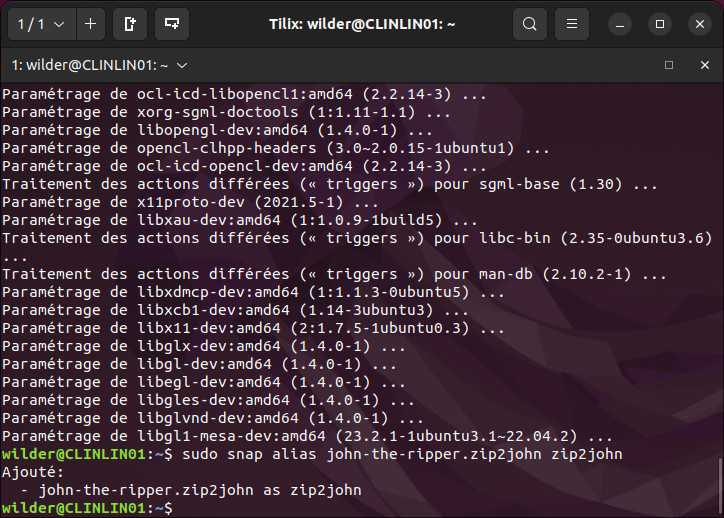
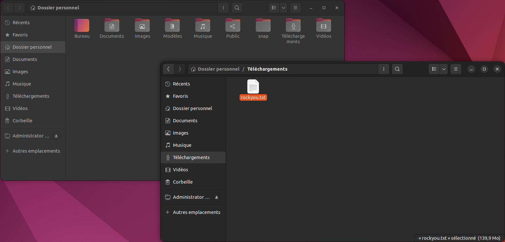
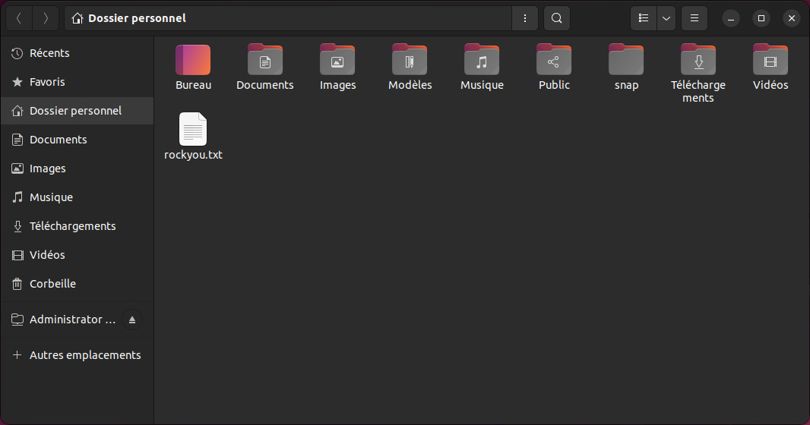

<div align="center"><h1>Sécurisation de mot de passe</h1></div>
<div align="center"><h1>Guide d'installation</h1></div>
<br>
<br>


<details>

<summary><strong><font size="+2">Sommaire</font></strong></summary>

- <b><i>Prérequis techniques</i></b>
  
- <b><i>Installation du poste Client</i></b>

- <b><i>Installation du poste Serveur</i></b>

- <b><i>Installation de l'outil JohnTheRipper</i></b>

- <b><i>Configuration du SSH</i></b>

- <b><i>FAQ</i></b>

</details>

<HR>

<details>

<summary><strong>Prérequis techniques</strong></summary>

<br>

Disposer de deux machines :

- Une machine avec un OS Ubuntu 22.04 LTS (Client)
- Une machine avec un OS Windows Server 2022 (Serveur)

Outils :

- L'outil [JohnTheRipper](https://github.com/openwall/john) (Version -jumbo)

</details>

<br>

<details>

<summary><strong>Installation du poste Client</strong></summary>

<br>

Pour le poste Client, il nous faut :
  - OS : [Ubuntu 22.04 LTS](https://releases.ubuntu.com/jammy/)
  - Nom : `CLILIN01`
  - Compte Utilisateur : `wilder`
  - Mot de passe : `Azerty1*`
  - Adresse IP fixe : `172.16.10.20/24`

<br>

- Installation des MàJ système :
```bash
sudo apt update && sudo apt upgrade -y
```
- Installation des "Guest Additions" (Dans le cadre d'une VM)
- Désactivation du parefeu :
```bash
sudo ufw disable
```

<br>


  

</details>

<br>

<details>

<summary><strong>Installation du poste Serveur</strong></summary>

<br>

Pour le poste Serveur, il nous faut : 
  - OS : [Windows Server 2022](https://www.microsoft.com/fr-fr/evalcenter/download-windows-server-2022)
  - Nom : `SRVWIN01`
  - Compte : `Administrator`
  - Mot de passe : `Azerty1*`
  - Adresse IP fixe : `172.16.10.10/24`

<br>

  - Installation des MàJ via Windows Update
  - Installation des "Guest Additions" (Dans le cadre d'une VM)
  - Désactivation du parefeu

</details>

<br>

<details>

<summary><strong>Installation de l'outil JohnTheRipper</strong></summary>

<br>

- Installation de l'outil [JohnTheRipper](https://github.com/openwall/john) :

```bash
sudo snap install john-the-ripper
```



<br>

- Installation des librairies de [JohnTheRipper](https://github.com/openwall/john) :

```bash
sudo apt install ocl-icd-opencl-dev -y
```



<br>

- Edition d'un alias  pour la commande `zip2john` :

```bash
  sudo snap alias john-the-ripper.zip2john zip2john
```



<br>

- ***[Optionnel]*** Téléchargement de la wordlist [rockyou](https://github.com/brannondorsey/naive-hashcat/releases/download/data/rockyou.txt)






</details>

<br>

<details>

<summary><strong>Configuration du SSH</strong></summary>

# Configuration du SSH

## 1. VM Windows Server
- Exécuter Powershell en "mode administrateur"

- Pour installer le service SSH :
```powershell
Add-WindowsCapability -Online -Name OpenSSH.Server
```
  


<br>

- Pour un démarrage automatique :

```powershell 
Set-Service sshd -StartupType Automatic
```


<br>

- Redémarer la VM et vérifier dans les Services que le serveur OpenSSH est bien "**en cours**" et en "**démarrage automatique**"


## 2. VM Ubuntu Client

- Exécuter le Terminal

- Pour installer le service SSH :
```bash
sudo apt-get install openssh-server
```


Lors du message : **`Souhaitez-vous continuer ? [O/n]`**-> Taper **`O`**

<br>

- Une fois le SSH installé, il faut l'activer :
```bash
 sudo systemctl enable ssh
```


<br>

- Pour terminer, génerer une clé à destination de Windows Server :  
```bash
ssh-keyscan -t rsa 172.16.10.10
```


<br>

- Redémarer la VM

# 3. Test transfert de fichier

Nous avons paramétré le service SSH sur les deux VM pour le partage de fichier.

- Sur la VM Server Windows, créer le fichier test1.txt à la racine du dossier Administrator :  
```powershell
New-Item -ItemType File -Path "test1.txt
```


- Depuis la VM Client Ubuntu, ouvrir le Terminal et taper la commande ci dessous:

```bash
scp Administrator@172.16.10.10:/C:/Users/Administrator/test1.txt ~/Documents
```


_Attention: le mot de passe demandé sera celui du compte Administrator Windows_

- Le fichier test1 est copié dans le dossier Documents du compte wilder.

<br>

# 4. Accès aux fichiers de Windows Server depuis Ubuntu

- Se rendre dans `Fichiers`, puis `Autres emplacements`, puis `Connexion à un serveur`, et taper l'adresse suivante :
```bash
ssh//Adminsitrator@172.16.10.10
```


Cliquer sur `Se connecter`

<br>

- Un mot de passe sera demandé, il s'agira de celui du compte Administrator de Windows Server
  


<br>

- L'accès aux fichiers situés sur Windows Server sera effectif


<br>

_Si problème, se reporter à la FAQ_

</details>

<br>

<details>

<summary><strong>FAQ</strong></summary>
<br>
 
***Q : Mes deux machines ne communiquent pas. Que dois-je faire ?***

_R : Pour résoudre ce problème, suivez ces étapes :_

- `Vérifiez si elles sont sur la même plage d'IP` : Assurez-vous que les deux machines sont configurées avec des adresses IP dans la même plage. Vous pouvez le vérifier en exécutant `ipconfig` sous `Windows` ou `ifconfig` sous `Linux` pour connaître leur adresse IP actuelle.

- `Désactivez les pare-feu Windows` : Parfois, le pare-feu peut empêcher la communication entre les machines. Essayez de désactiver temporairement le pare-feu pour voir si cela résout le problème.

- `Effectuez un test ping` : Utilisez la commande ping suivi de l'adresse IP de l'autre machine pour vérifier s'il y a une réponse. Cela indique si les deux machines peuvent communiquer entre elles.

***Q : Je n'arrive pas à me connecter en SSH. Quelle pourrait être la cause ?***

_R : Si vous rencontrez des difficultés pour établir une connexion SSH, suivez ces vérifications :_

- `Vérifiez l'installation d'OpenSSH` : Assurez-vous que le logiciel OpenSSH est correctement installé sur votre machine ainsi que sur celle à laquelle vous tentez de vous connecter. Sous Windows, vous pouvez l'installer via les fonctionnalités facultatives, tandis que sous Linux, vous pouvez l'installer à partir du gestionnaire de paquets.
  
- `Activez le service SSH` : Le service SSH doit être activé et en cours d'exécution sur la machine distante. Sous Linux, vérifiez cela avec `sudo systemctl` status ssh et activez-le si nécessaire avec `sudo systemctl start ssh`.
  
- `Vérifiez les paramètres du pare-feu` : Assurez-vous que le pare-feu de la machine distante autorise les connexions sur le port utilisé par SSH.

</details>
